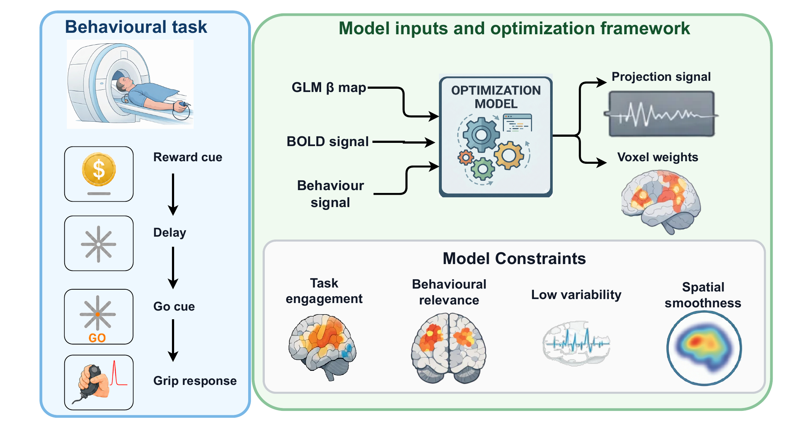

<div align="center">

# Motor Vigour Variability in Parkinson's Disease

**A curated reproducibility package for a study of trial-to-trial motor vigour
variability in Parkinson's disease, combining trial-wise fMRI, reaction-time
behaviour, medication state, and galvanic vestibular stimulation (GVS).**


&nbsp;

&nbsp;

&nbsp;


<br>



</div>

<p align="center">
<em><strong>Figure 1.</strong> Overview of the behavioural task and the constrained optimization
framework. A ballistic hand-squeeze task (reward cue&nbsp;&rarr; delay&nbsp;&rarr; go cue&nbsp;&rarr; grip
response) is acquired during fMRI; trial-wise GLM&nbsp;&beta; maps, BOLD, and behaviour feed an
optimization model that returns a vigour-network projection signal and voxel weights under
task-engagement, behavioural-relevance, low-variability, and spatial-smoothness constraints.</em>
</p>

---

## Overview

This repository is a curated reproducibility package for a study of
trial-to-trial motor vigour variability in Parkinson's disease (PD). The
analysis combines trial-wise fMRI estimates, reaction-time behaviour, medication
state, and galvanic vestibular stimulation (GVS) during a ballistic
hand-squeeze task.

The central question is whether behavioural variability in PD reflects an
unstable central vigour-related neural signal, or whether a comparatively stable
neural signal becomes more variable as it is translated into movement. The
included code and outputs support the manuscript analyses identifying a
vigour-related network whose activity remains related to behaviour while varying
less abruptly than the behaviour itself.

## Highlights

- **Cohort & design** — 18 participants with PD scanned OFF- and ON-medication
  during GVS, performing a ballistic hand-squeeze task.
- **Trial-wise modelling** — single-trial fMRI responses estimated with GLMsingle
  and entered into a constrained optimisation framework.
- **Vigour network** — a network that is task-active, behaviourally relevant, and
  low in trial-to-trial variability, recovered under explicit spatial-smoothness
  constraints (see Figure 1).
- **Mechanistic tests** — medication-related connectivity changes and GVS
  perturbations of the network are characterised.
- **Reproducible by design** — final figures, companion result tables, derived
  brain maps, and figure-level entry scripts are packaged together.

## Repository Scope

This repository is intended for readers, reviewers, and future users of the
paper. It is smaller than the original working analysis directory and contains
the materials needed to inspect the reported outputs and rerun selected curated
analyses.

Included here:

- final main and supplementary figure exports in PNG and PDF formats;
- companion result tables, summaries, and provenance files behind the figures;
- compact derived brain maps, metadata, and processed GVS connectivity tables;
- figure-level entry scripts under `scripts/`;
- longer analysis implementations under `analysis/`.

Not included here:

- raw or preprocessed subject-level fMRI data;
- full subject-level GLMsingle beta datasets;
- access-controlled behavioural source files;
- large intermediate working folders from exploratory analyses.

Some scripts therefore run directly from packaged derived data, while others
require external subject-level inputs. See [External Data](#external-data) for
details.

## Study Overview

The manuscript uses trial-wise fMRI and reaction-time data from 18 participants
with PD tested in OFF- and ON-medication sessions during GVS. Single-trial fMRI
responses were estimated with GLMsingle and entered into a constrained
optimisation framework designed to find a network that was task-active, encoded
behaviour, and had low trial-to-trial variability.

The resulting vigour network includes motor, striatal, cerebellar, thalamic,
parietal, temporal-limbic, and orbitofrontal regions. The analysis compares this
network with conventional task activation, tests medication-related connectivity
changes, and explores GVS-related perturbations of network connectivity.

## Repository Layout

| Path | Contents | Typical use |
| --- | --- | --- |
| `figures/main/` | Final main manuscript figures. | Inspect or cite figure exports. |
| `figures/supplementary/` | Final supplementary figures. | Inspect supplementary outputs. |
| `results/main/` | CSV, JSON, NPZ, Markdown, and source exports for main figures. | Check numerical values and provenance. |
| `results/supplementary/` | Companion outputs for supplementary analyses. | Check supplementary tables, summaries, and provenance. |
| `scripts/` | Short figure-level entry points. | Start here when rerunning curated analyses. |
| `analysis/` | Longer implementation modules called by `scripts/`. | Inspect or modify analysis methods. |
| `data/derived_maps/` | Compact NIfTI and HTML maps used by figure scripts. | Inspect or reuse derived brain maps. |
| `data/processed/` | Processed GVS connectivity inputs included with this package. | Rerun selected connectivity summaries. |
| `data/metadata/` | Study metadata files included for provenance. | Check session/run metadata. |
| `data/external/` | Notes on required files that are not packaged. | Configure restricted external inputs. |

## Quick Start

Create a Python environment from the repository root:

```bash
python -m venv .venv
source .venv/bin/activate
pip install -r requirements.txt
```

Run a figure script from the repository root:

```bash
python scripts/figure_03_vigour_network_map.py
```

Most top-level scripts are thin wrappers. For example:

```text
You run:        scripts/figure_03_vigour_network_map.py
It calls:       analysis/modules/plot_weight_multiplane_colorbar.py
It writes to:   results/main/figure_03_vigour_network_map/
Final export:   figures/main/figure_03_vigour_network_voxel_weights.png
```

Use `python scripts/<script_name>.py --help` to inspect configurable paths when
the underlying analysis exposes command-line options.

## Main Figures

| Paper panel | Curated figure file | Entry script |
| --- | --- | --- |
| Figure 2A | `figures/main/figure_02a_behavior_projection_subject_panel.png` | `scripts/figure_02a_behavior_projection.py` |
| Figure 2B | `figures/main/figure_02b_trial_variability_hypothesis.png` | `scripts/figure_02b_trial_variability_hypothesis.py` |
| Figure 3 | `figures/main/figure_03_vigour_network_voxel_weights.png` | `scripts/figure_03_vigour_network_map.py` |
| Figure 4 | `figures/main/figure_04_full_model_vs_task_only_anatomy.png` | `scripts/figure_04_ablation_anatomy.py` |
| Figure 5 | `figures/main/figure_05_full_model_vs_task_only_roi_summary.png` | `scripts/figure_05_ablation_roi_summary.py` |
| Figure 6A | `figures/main/figure_06a_medication_fc_vigour_network.png` | `scripts/figure_06a_medication_vigour_network_fc.py` |
| Figure 6B | `figures/main/figure_06b_medication_fc_task_activation.png` | `scripts/figure_06b_medication_task_activation_fc.py` |
| Figure 7A | `figures/main/figure_07a_gvs_connectogram_vigour_network.png` | `scripts/figure_07a_gvs_vigour_connectogram.py` |
| Figure 8A | `figures/main/figure_08a_gvs_rt_lme_boxplot.png` | `scripts/figure_08_gvs_effects.py` |
| Figure 8B | `figures/main/figure_08b_gvs_vigour_network_feature_delta.png` | `scripts/figure_08_gvs_effects.py` |
| Figure 8C | `figures/main/figure_08c_gvs_task_activation_feature_delta.png` | `scripts/figure_08_gvs_effects.py` |

Additional GVS supplementary exports are provided in `figures/supplementary/`,
including Supplementary Figures 13A-B, 14, 15A-B, 16A-B, and 17, with matching
PDF exports.

The full main-figure inventory is stored in
`figures/main/figure_manifest.csv`. Supplementary figure exports and their
source locations are listed in
`figures/supplementary/supplementary_figure_manifest.csv`.

## Reproducibility Notes

The curated figure exports and companion result files are already included.
Rerunning scripts may overwrite files in `results/` and `figures/`.

The reproducibility scope differs by analysis:

| Task | Status in this repository |
| --- | --- |
| Inspect final figures and reported numerical summaries | Fully supported with packaged files. |
| Replot selected figures from compact derived maps or processed tables | Supported where the required packaged inputs are present. |
| Recompute trial-wise projections, medication connectivity, or behavioural summaries from subject-level data | Requires external subject-level beta and behavioural inputs. |
| Re-run the FSL first-level and mixed-model workflow for the standard GLM supplementary figure | Requires FSL and external BOLD inputs. |
| Recreate the entire project from raw data | Not supported by this curated repository. |

Some implementation modules retain absolute default paths from the original
analysis environment. On another machine, pass the corresponding command-line
arguments or edit the paths before rerunning those analyses.

## External Data

External data requirements are documented in `data/external/README.md`. The
packaged `data/` directory contains compact derived maps, metadata, and selected
processed tables, not the full raw or preprocessed subject-level dataset.

The expected external resources include subject-level beta files, behavioural
source files, group-concatenated BOLD inputs, FSL atlas resources, and cached
Nilearn atlases. These files may be large, access-controlled, or institutionally
restricted.

## Dependencies

Python dependencies are listed in `requirements.txt`. The main scientific stack
includes NumPy, pandas, SciPy, statsmodels, Matplotlib, nibabel, Nilearn,
scikit-learn, pingouin, Pillow, and h5py. FSL is only required for rerunning the
standard-GLM workflow behind the relevant supplementary figure.

## Citation

If you use this repository, please cite the associated manuscript and an
archived release of this repository when available. If no repository DOI has
been minted, cite the repository URL and the commit hash used for the analysis.

Repository:

```text
https://github.com/zahra1379kavian/Motor_Vigour-Variability-Reproducibility
```
